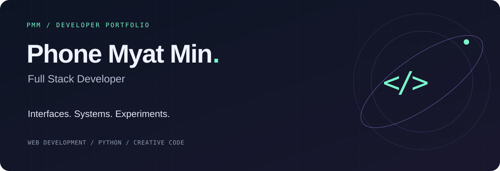
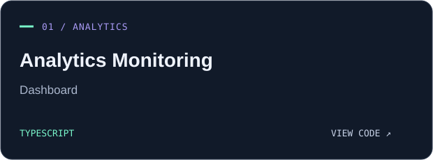
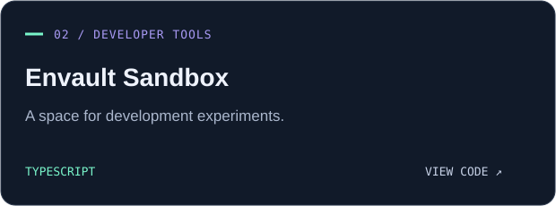
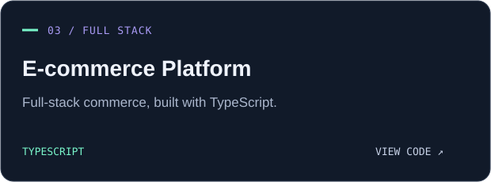
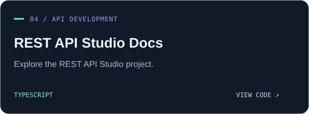

  <a href="https://github.com/Vera93203?tab=repositories">Explore my repositories</a> &nbsp; · &nbsp;
  <a href="https://github.com/Vera93203/full-stack-e-commerce-platform">Explore my e-commerce project</a>

### A little about me

Hi, I'm **Phone Myat Min** — a full-stack developer. My projects span analytics dashboards, developer tools, e-commerce, and API development. This is where I share what I build and explore ideas through code.

**Languages across my projects** &nbsp; `JavaScript` · `TypeScript` · `Python` · `CSS`

### Selected work

<table>
<tr>
<td width="50%"></td>
<td width="50%"></td>
</tr>
<tr>
<td width="50%"></td>
<td width="50%"></td>
</tr>
</table>

### The learning lab

[**Python OOP**](https://github.com/Vera93203/Python_OOP) — exploring object-oriented Python.  
[**Node.js Course**](https://github.com/Vera93203/Nodejs_Course) — a repository for my Node.js coursework.

---

Phone Myat Min &nbsp; / &nbsp; <a href="https://github.com/Vera93203">@Vera93203</a> &nbsp; / &nbsp; Built one idea at a time.

